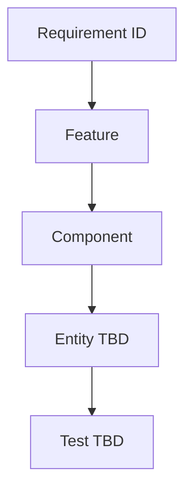

# System Graphs — Documentation Method

This document establishes a **method** for documenting important relationships as explicit graphs. Entity relationships are **not finalized** at this stage.

## Purpose

Graphs make dependencies visible across requirements, features, components, data entities, and tests. They help AI agents and humans load the right context and avoid implicit assumptions.

## When to Create a Graph

Create or update a graph when:

- A new feature spans multiple layers (UI → API → domain → DB → export)
- Data relationships are confirmed during analysis
- Export or migration mappings involve non-obvious transformations
- Security boundaries need explicit documentation

Do **not** create detailed entity graphs until legacy and MDB analysis produce verified field lists.

## Graph Types

### 1. Requirement Traceability

```
Requirement → Feature → Component → Service → Database Entity → Test
```

Use to answer: "What tests prove this requirement?"

### 2. Registration Domain (Placeholder)

Relationships below are **illustrative placeholders** — not verified schema.

```
Student
  ├── Personal Address          (separate entity — VERIFIED requirement)
  ├── Contact Person
  │     └── Contact Person Address   (separate entity — VERIFIED requirement)
  ├── Photo                     (application media + metadata + MDB binary)
  ├── Signature                 (admin upload; application media + MDB binary)
  └── Registration
        └── Academic Year
              ├── Course
              └── Section
```

Field names, cardinality, and attributes: **TBD** after analysis.

### 3. Data Structure Separation

```
Legacy Python Schema ──analysis──► Migration Mapping ──► Canonical Model
MDB Schema ──analysis──► Export Mapping ◄── Canonical Model
```

### 4. Export Pipeline (Future)

```
Canonical Model → Export Contract → Transformers → CSV (MDB-compatible)
                                                 → XLSX
                                                 → PDF
```

### 5. Security Boundaries (Future)

```
Public: Student Registration API (rate-limited)
Authenticated Admin: Admin Panel API
Private: Media storage (photos, signatures)
```

## Format

Use **Mermaid** diagrams in markdown where possible for version control and rendering in GitHub/Cursor.

Example template:



Mark unverified nodes with `(TBD)` or `(REQUIRES VERIFICATION)`.

## Storage

- Architecture-level graphs: `docs/architecture/`
- Domain/data graphs (after analysis): `docs/database/`
- Feature-specific graphs: co-locate with feature spec when those exist

## Maintenance

Update graphs when:

- Analysis confirms or refutes a relationship
- Architecture decisions change
- Export or migration contracts are approved

Remove or revise placeholder graphs rather than letting them become false documentation.
