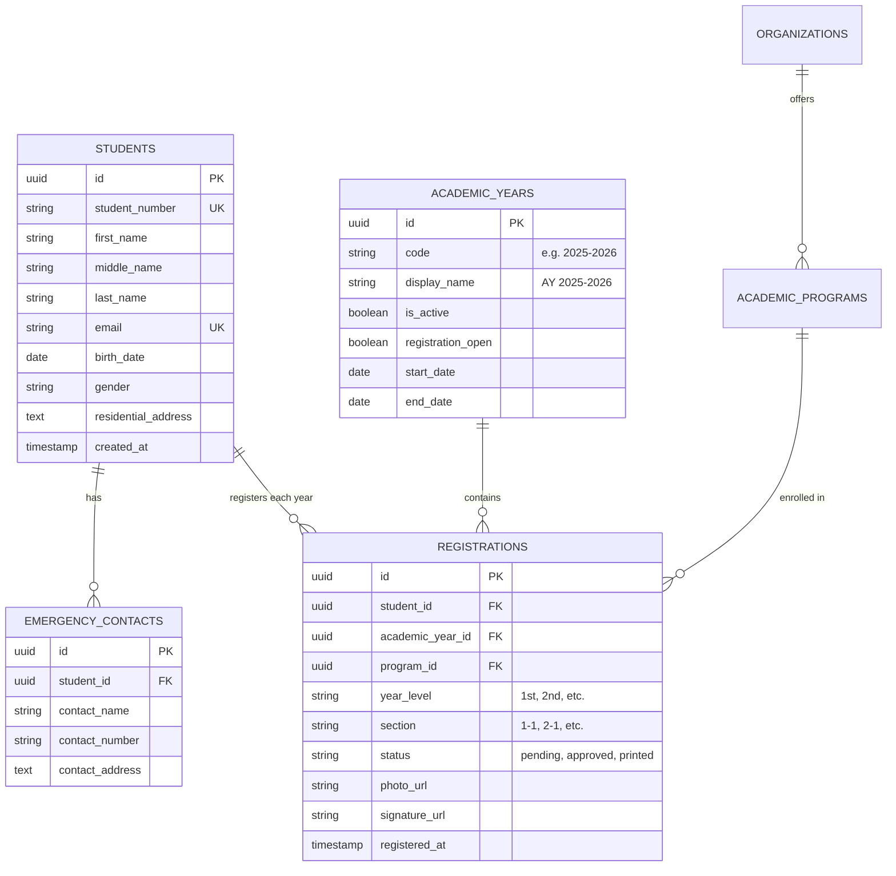

# Architectural & Capacity Research: System Scope, Supabase Storage, and Multi-Year Modeling

## Executive Summary

1. **System Scope Recommendation**:
   - **Do NOT build a full University ERP/SIS** (grades, tuition, scheduling, transcripts). That creates legal liability under the Data Privacy Act of 2012 (RA 10173) and unmanageable scope creep for a student organization project.
   - **DO build an Authoritative Student Registry & ID Credentialing System**. It should persistently store student identity, annual enrollment records, organization affiliations, and ID media assets across academic years, serving as the trusted source of truth for ID printing, CardFive exports, and membership tracking.

2. **Storage Capacity Feasibility (1,200+ students/year)**:
   - **PostgreSQL Database**: **100% safe on Supabase Free Tier**. 1,200 students generate ~2.5 MB of relational data per year. After 5 years (~6,000 students), the database will only consume ~15–20 MB (< 4% of Supabase's 500 MB free limit).
   - **Media Storage (Photos & Signatures)**: **The primary bottleneck**. Raw uploads (5 MB photo + signature) would exhaust Supabase's 1 GB free bucket storage within 4 months. However, with **client-side image compression** (producing 250 KB portraits at 300 DPI print quality), 1,200 students consume **~360 MB/year**, lasting ~2.5 years on the free tier.
   - **Zero-Cost Scaling Strategy**: Pairing Supabase Postgres with **Cloudflare R2** (10 GB free forever, zero egress fees) yields **15+ years of zero-cost media storage**.

3. **Switching Academic Years**:
   - **100% feasible, highly recommended, and already a verified requirement (R-ADM-10, R-ADM-11)**.
   - Relational modeling separates permanent student identity (`students`) from annual enrollment entries (`registrations` linked to `academic_years`). Switching or filtering academic years is instantaneous and computationally trivial in PostgreSQL.

---

## 1. System Scope Analysis: Registry vs. Full Data Collection

| Dimension | Option A: Disposable Form (Old Legacy) | Option B: Full University SIS / ERP | Option C: Authoritative Student Registry & ID Platform (Recommended) |
|---|---|---|---|
| **Concept** | Disposable form dumping data to CSV/MDB every year | Massive system tracking grades, balances, course prerequisites, attendance | Persistent directory tracking student identity, annual enrollment, and ID credentialing |
| **Data Scope** | Single flat record per submit | Everything (grades, transcripts, tuition, schedules) | Personal info, addresses, organization membership, academic year, photo & signature |
| **Legal / Compliance (RA 10173)** | Minimal, but insecure handling of photos/PII | High liability; requires official registrar mandate | Secure, compliant, role-based access; clearly bounded purpose |
| **Maintenance Burden** | High manual data cleanup every year | Prohibitive for student engineering team | Low, automated, robust, clean migration paths |
| **Multi-Year Support** | Nonexistent (overwrites / exports CSV) | Complex semester credit trees | Clean annual registrations linked to academic years |

### Recommendation
Adopt **Option C**. Treat the system as a **Student Directory & Identity Issuance Platform**. It maintains persistent records of who students are, what organization they belong to, their contact details, and their ID credentials over time, without bloating into university registrar operations.

---

## 2. Storage & Capacity Calculations (1,200 Students / Year)

### A. Database Storage (Supabase PostgreSQL)

| Metric | Per Student | Annual (1,200 Students) | 5 Years (6,000 Students) | 10 Years (12,000 Students) |
|---|---|---|---|---|
| Core row (`students`) | ~800 bytes | ~0.96 MB | ~4.8 MB | ~9.6 MB |
| Annual registration (`registrations`) | ~400 bytes | ~0.48 MB | ~2.4 MB | ~4.8 MB |
| Addresses & Emergency Contact | ~500 bytes | ~0.60 MB | ~3.0 MB | ~6.0 MB |
| B-Tree Indexes & Overhead | ~400 bytes | ~0.48 MB | ~2.4 MB | ~4.8 MB |
| **Total Database Size** | **~2.1 KB** | **~2.52 MB** | **~12.6 MB** | **~25.2 MB** |

> [!NOTE]
> **Supabase Free Database Capacity**: **500 MB**.
> Even after **10 years** of continuous operations with 12,000 students, the database will consume **under 30 MB** (approx. 6% of the free quota). Database capacity is **never a problem**.

---

### B. Media Storage (Photos & Signatures)

Each student requires two media assets:
1. **Student Photo**: 1500 × 1500 px (300 DPI PVC card print requirement)
2. **Student Signature**: 2000 × 1200 px (admin upload, black ink on white)

#### Scenario 1: Uncompressed Raw Uploads (High Risk)
- Raw camera photo: ~2.5 MB
- Raw signature: ~600 KB
- Total per student: **~3.1 MB**
- **Annual storage**: 1,200 × 3.1 MB = **3.72 GB / year**
- **Supabase Free Limit (1 GB)**: **Exhausted in ~3.2 months**.

#### Scenario 2: Optimized JPEG / WebP (Recommended)
- 1500 × 1500 px JPEG at 85% quality: **~220 KB** (pristine print resolution)
- 2000 × 1200 px Signature (1-bit / high contrast WebP): **~80 KB**
- Total per student: **~300 KB**
- **Annual storage**: 1,200 × 300 KB = **~360 MB / year**
- **Supabase Free Limit (1 GB)**: Lasts **~2.7 years** before needing cleanup or upgrade.

#### Scenario 3: Cloudflare R2 Integration (Best Architecture for Longevity)
- Cloudflare R2 provides **10 GB of free object storage forever** with **$0 egress bandwidth fees**.
- 10 GB ÷ 360 MB/year = **Over 27 years of free storage** for 1,200 students/year.
- Beyond 10 GB: costs only **$0.015 / GB / month** (less than $0.20 per year).

---

### C. Vercel Serverless Function Limits & Pitfalls

> [!WARNING]
> **Vercel Hobby (Free Plan) Request Body Limit**: **4.5 MB**.
> If a student uploads a 5 MB raw camera photo directly to a Vercel serverless API route (`/api/upload`), Vercel will immediately drop the connection with `413 Payload Too Large`.

#### Architecture Solutions:
1. **Browser-Side Canvas Resizing & Compression**:
   Before the photo ever leaves the student's browser, use an HTML5 canvas to resize to exactly 1500 × 1500 px and compress to 85% JPEG (`~250 KB`).
   - *Benefits*: 20x faster uploads for students on mobile data; zero Vercel payload limit issues; negligible server compute.
2. **Direct-to-Storage Presigned URLs**:
   The frontend requests a signed upload URL from the backend and uploads the file directly to the Supabase Storage or Cloudflare R2 bucket, completely bypassing the Vercel serverless layer.

---

## 3. Multi-Year Architecture & Switching Academic Years

Switching academic years is not only feasible, it is essential. A normalized relational model prevents duplicate student profiles while isolating registrations per year.

### Normalized Relational Schema



### Why This Architecture Solves All Multi-Year Concerns:
1. **Zero Redundancy**: When a 1st-year student advances to 2nd year in AY 2026–2027, their permanent profile (`name`, `student_number`, `birth_date`) is not re-entered. A new `registration` row is simply created for that year.
2. **One-Click Academic Year Switching**:
   - The admin panel simply sets `is_active = true` on the new academic year.
   - All dashboard statistics, student lists, and exports automatically scope to the active academic year by default (`WHERE academic_year_id = active_ay_id`).
3. **Instant Historical Archive Lookup**:
   - If an admin needs to view or reprint an ID from AY 2024–2025, they select the academic year filter in the Registrations view.
4. **Performance**:
   - Querying 1,200 or even 20,000 indexed rows by `academic_year_id` takes **< 2 milliseconds** in PostgreSQL.

---

## 4. Recommended Infrastructure Blueprint

```
[Student / Admin Client]
         │
         ├──► [Vercel] (Next.js / Vite SPA Frontend + Auth Middleware)
         │
         ├──► [Supabase PostgreSQL] (Metadata, Registrations, Audits)
         │       └─ 500 MB Free Tier (Takes 10+ years to use even 6%)
         │
         └──► [Cloudflare R2 OR Supabase Storage (Optimized)] (Photos & Signatures)
                 └─ Client-compressed images (250 KB photo + 80 KB signature)
                 └─ 10 GB Free on R2 = 25+ years of storage for $0
```

### Summary Decision Checklist:
- [x] **Database Choice**: Supabase PostgreSQL is ideal and won't exceed free limits.
- [x] **Multi-Year Switcher**: Standard practice, fully feasible, zero performance penalty.
- [x] **Image Strategy**: Client-side resize to 1500 × 1500 px at 85% JPEG before upload.
- [x] **Storage Provider**: Supabase Storage with client compression for Years 1–2; Cloudflare R2 for indefinite zero-cost scaling.
- [x] **System Scope**: Authoritative Student Directory & ID Credentialing Platform.
